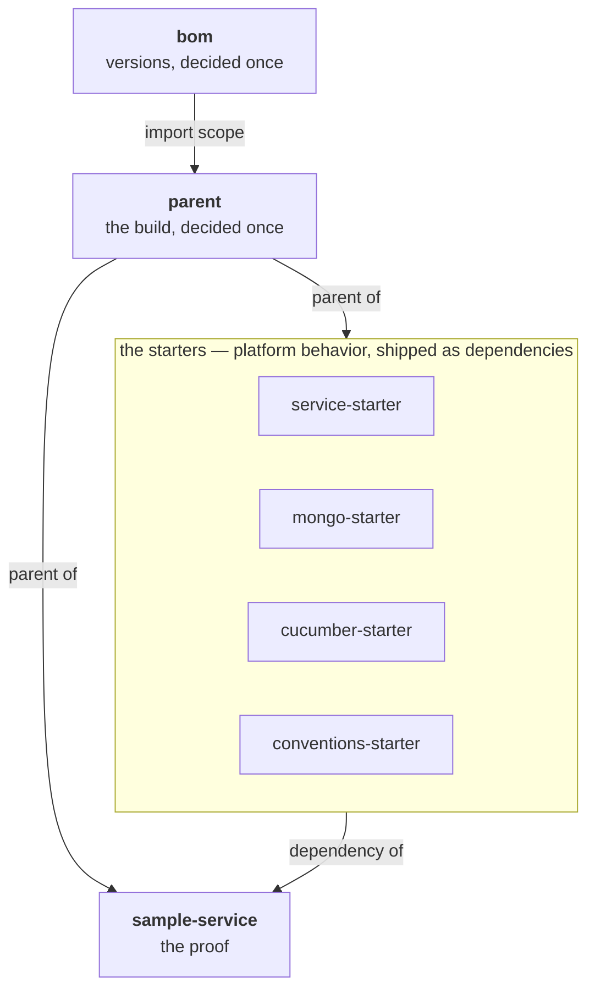

# 🛣️ spring-paved-road

[](https://github.com/vspiewak/spring-paved-road/actions/workflows/build.yml)  

**The paved road : parent, BOM & Spring Boot starters that align a whole fleet — distilled into one runnable monorepo.**

At work, these patterns govern ~100 Spring Boot microservices maintained by ~80 engineers :
one `<parent>` line in a service's pom, and it inherits version coherence, formatting law,
style rules and platform behavior. This repo is the pattern, extracted and runnable.

📝 The story so far : [migrating 1,273 repos in under an hour](https://vspiewak.com/migrating-1200-repos-from-bitbucket-to-github-in-under-an-hour) ·
[27,000+ PRs with gh-auto-updater](https://vspiewak.com/gh-auto-updater-mass-pull-requests-across-a-repo-fleet) — more on [vspiewak.com](https://vspiewak.com)

## 💡 The idea

A **paved road** is not a fence. Services get :

* **defaults they can override** — sane platform behavior, applied unless the service says otherwise
* **mandates they cannot** — security & governance values that win over any service configuration
* and everything else — versions, formatting, style — **by inheritance, not by copy-paste**

The whole pitch fits in one diff. A service pom, before and after :

```diff
 <parent>
-   <groupId>org.springframework.boot</groupId>
-   <artifactId>spring-boot-starter-parent</artifactId>
-   <version>4.1.0</version>
+   <groupId>com.vspiewak</groupId>
+   <artifactId>parent</artifactId>
+   <version>0.0.1-SNAPSHOT</version>
 </parent>
```

## 🧱 Modules

| Module | Role |
|---|---|
| [`bom/`](./bom) | Versions, decided once — services never write a `<version>` again |
| [`parent/`](./parent) | The build, decided once — plugins, formatting law, style rules, test lanes |
| [`service‑starter/`](./service-starter) | Sane defaults & platform mandates, shipped as a dependency |
| [`mongo‑starter/`](./mongo-starter) | The MongoDB defaults every service wants — self-seeding local dev, self-identifying connections |
| [`cucumber‑starter/`](./cucumber-starter) | The BDD vocabulary, written once — services write features, not glue |
| [`conventions‑starter/`](./conventions-starter) | The conventions, as tests that fail the build instead of review comments |
| [`sample‑service/`](./sample-service) | The proof — one service consuming all of it, **the tests are the documentation** |



## 📌 `bom` — versions, decided once

Imports `spring-boot-dependencies`, then adds the pins Boot doesn't manage — `cucumber-bom`,
`archunit`, and the platform's own starters — under a comment that says exactly that : *our own
pins start here*. Every module and service downstream declares its dependencies **versionless** ;
upgrading the fleet is one diff in one file.

## 🏗️ `parent` — the build, decided once

Every service inherits the same build by pointing at this parent, which **imports** the bom
(no parent-chaining — the two concerns stay separately releasable) :

* every plugin version pinned once in `pluginManagement`
* the formatting law : [Spotless](https://github.com/diffplug/spotless) with google-java-format,
  sortPom, yaml & markdown — `spotless:check` runs at **`compile`**, so a formatting slip fails
  the build in *both* lanes, and `./format.sh` is the one command that fixes it
* a deliberately tiny [Checkstyle](https://checkstyle.org) ruleset — the interesting rules live in
  `conventions-starter`, as tests
* the **version mandate** : [maven-enforcer](https://maven.apache.org/enforcer/) fails the build on
  any dependency declaring a `<version>` — versions come from the bom, period
* and the test **lanes** : surefire / failsafe split on the `*IT` suffix,
  [JaCoCo](https://www.jacoco.org) covering both

The version mandate has one escape hatch : groupIds on the allow-list
(`enforcer.versionOverride.allowedGroupIds`, here `com.vspiewak.dto`) may pin their own version —
contract (DTO) artifacts evolve at the pace of their producer / consumer pair, not the fleet.
Try it : add a `<version>` to any dependency in `sample-service`, and the build stops you at
`validate` — before a single class is compiled :


It caught its first offender during its own introduction : `sample-service` itself, which pinned
the starters with `${project.version}` until the bom managed them.

```bash
./mvnw test          # fast lane : unit & slice tests — seconds, no Docker
./mvnw verify        # full lane : + *IT integration tests (Testcontainers) + coverage report
```


Break the formatting law and the build prints the offending diff and the fix :


`./format.sh` runs that `spotless:apply` across every governed module, skipping the bom and the root
aggregator : outside the parent chain, a naive `spotless:apply` resolves an **unpinned** spotless —
3.10.0 instead of the managed 3.9.0 — and fails on the bom anyway. A service under the parent needs
no script : `./mvnw spotless:apply`, as the failure message says.

Three hard-earned details, all of them failsafe / JaCoCo :

* the JaCoCo report is bound to **`post-integration-test`** — bind it any earlier and
  integration-test coverage silently vanishes from the report. Ask me how I know 🥲
* failsafe's `classesDirectory` defaults to *the built artifact JAR* — which, after
  `spring-boot:repackage`, is the fat jar with the classes buried under `BOOT-INF/classes`.
  Pointing it back at `${project.build.outputDirectory}` runs the `*IT` lane against plain class
  files, exactly like the fast lane.
* the Gherkin HTML report is switched on through failsafe's `argLine` — which **must** keep the
  `@{argLine}` placeholder, because that placeholder *is* the JaCoCo agent. Overwrite it and
  coverage quietly drops to zero.

Both reports land under `sample-service/target/site/` : coverage in `jacoco/index.html`, the
Gherkin run in `cucumber/index.html`.


## 🍃 `service-starter` — platform behavior as a dependency

How every service behaves at runtime : sane defaults, platform mandates, auto-configured beans.
Both Boot extension points on display — an `EnvironmentPostProcessor` registered in
`spring.factories` (the property ladder) and an `@AutoConfiguration` registered in
`AutoConfiguration.imports` (the flight recorder).

### 🪜 The property ladder

Configuration is layered around the application, lowest to highest precedence :

```text
platform-default.yaml                      # defaults (service CAN override)
  < application.yaml                       # the service's own configuration
    < platform-override.yaml               # mandates (service CANNOT override)
      < platform-override-<profile>.yaml   # per-profile mandates
```

Proven by [`PlatformPropertiesTest`](./sample-service/src/test/java/com/vspiewak/sample/platform/PlatformPropertiesTest.java) —
including the fun one : `sample-service` *tries* to set `management.endpoint.env.show-values: always`,
and the platform answers `never` 🔒 — and by the starter's own
[`ServiceStarterIT`](./service-starter/src/test/java/com/vspiewak/pavedroad/env/ServiceStarterIT.java),
booting a bare context with zero service configuration.

### ✈️ The HTTP flight recorder

Boot ships the `/actuator/httpexchanges` endpoint but deliberately never auto-configures the
`HttpExchangeRepository` backing it — expose the endpoint without one and you get nothing.
`service-starter` fills exactly that gap : the endpoint is in the platform's exposure defaults, and
[`HttpExchangeConfig`](./service-starter/src/main/java/com/vspiewak/pavedroad/actuator/HttpExchangeConfig.java)
provides the in-memory repository (last 100 exchanges) whenever the endpoint is available — every
service gets a free last-requests flight recorder. A service defining its own repository bean
replaces it (`@ConditionalOnMissingBean`).

Proven by [`HttpExchangeConfigTest`](./service-starter/src/test/java/com/vspiewak/pavedroad/actuator/HttpExchangeConfigTest.java)
(provided when exposed, absent when not, backs off to a service-owned bean) and end-to-end by
[`HttpExchangesIT`](./sample-service/src/test/java/com/vspiewak/sample/platform/HttpExchangesIT.java) :
make a request, find it in `/actuator/httpexchanges`.

### 🚨 The error contract

`spring.mvc.problemdetails.enabled` lives in the **override** layer — a mandate, so the fleet's
error shape is not a per-service choice :

```text
before   application/json          {"timestamp","status","error","path"}
after    application/problem+json  {"type","title","status","detail","instance"}
```

On top of it, `service-starter` ships a
[`@ControllerAdvice`](./service-starter/src/main/java/com/vspiewak/pavedroad/web/PlatformProblemDetailAdvice.java)
stamping each problem with its origin — the same `spring.application.name` that is on the banner and
on every log line :

```json
{"instance":"/orders/v1/orders/999","status":404,"title":"Not Found","service":"sample-service"}
```

`traceId` joins it when the MDC has one. `type` stays `about:blank` until a service declares one
under `problemDetail.type.<exception FQCN>`, which Spring resolves through the `MessageSource`.

Proven in business language, in
[`service.feature`](./sample-service/src/test/resources/features/service.feature) :

```gherkin
Scenario: Unknown orders are a 404, in the platform's error shape
  When I send a GET request to "/orders/v1/orders/999"
  Then the response status is 404
  And the response content type is "application/problem+json"
  And the response json path "$.title" is "Not Found"
  And the response json path "$.service" is "sample-service"
```

### 🪧 What a service inherits without asking

Two things ride on the default layer, and no service configures either. Identity — the platform
ships [`platform-banner.txt`](./service-starter/src/main/resources/platform-banner.txt) and points
`spring.banner.location` at it :


And the shape of every line that service will ever log :

```yaml
logging:
  level:
    root: "INFO"
    org.mongodb.driver: "WARN"
    org.apache.catalina: "WARN"
  pattern:
    console: "%clr(%d{yyyy-MM-dd'T'HH:mm:ss.SSSXXX}){faint} %clr(%5p) %clr(%esb(){APPLICATION_NAME}){blue} ..."
```

```text
2026-08-26T00:07:04.894+02:00  INFO [sample-service]  c.v.sample.SampleServiceApplication : Starting SampleServiceApplication
```

Boot's PID and `---` are gone, the service name is in, and quieting those two dependencies takes a
bare `sample-service` boot from **15 log lines to 11**.

Both are **defaults**, so both bend : `spring.banner.location` for a service that wants its own
banner, `logging.level.org.mongodb.driver: DEBUG` for one that needs the driver's chatter — each
wins. `logging.config` is deliberately left unset, so a service that outgrows the defaults writes an
ordinary `logback-spring.xml` and is simply obeyed. All of it proven in
[`PlatformPropertiesTest`](./sample-service/src/test/java/com/vspiewak/sample/platform/PlatformPropertiesTest.java).

## 🥭 `mongo-starter` — seeded locally, named everywhere

How every service talks to MongoDB : a local dev loop that seeds itself, and connections that
identify themselves.

### 🌱 Local auto-load

Seeds your local MongoDB at startup, from plain JSON files :

```text
src/test/resources/mongo/import/
├── orders/                  # directory name = collection name
│   ├── order1.json          # one document per file
│   └── order2.json
└── products/
    └── product1.json
```

* runs only under the `local` profile, on `ApplicationReadyEvent`
* **host-guarded** 🔒 : unless every Mongo host is `localhost` / `127.0.0.1`, it refuses to load —
  a misconfigured URI can never seed a shared or production cluster
* knobs : `platform.mongo.data-import.enabled` (default `true`) and `platform.mongo.data-import.path`

Proven by [`MongoDataImporterTest`](./mongo-starter/src/test/java/com/vspiewak/pavedroad/mongo/MongoDataImporterTest.java) —
including the one that matters : remote hosts → nothing gets loaded. And end-to-end by
[`MongoAutoLoadIT`](./sample-service/src/test/java/com/vspiewak/sample/platform/MongoAutoLoadIT.java) :
the booted `sample-service`, under the `local` profile, finds the seed in its database.

### 🏷️ Connections, named

Defaults the driver's `applicationName` to `spring.application.name` — so connections show up
under the service name in Atlas / server logs, without every service appending `appName=...` to
its URI. Textbook paved road :

* an `appName` set explicitly in the URI **wins** — Boot's own customizer (order 0) applies the
  connection string first ; this unordered one runs after and only fills the gap
* a service defining its own `mongoAppNameCustomizer` bean replaces it (`@ConditionalOnMissingBean`)
* kill switch : `platform.mongo.app-name.enabled=false`

Proven by [`MongoAppNameConfigTest`](./mongo-starter/src/test/java/com/vspiewak/pavedroad/mongo/MongoAppNameConfigTest.java) —
including through Boot's **full** customizer chain, both directions. And end-to-end, server-side, by
[`MongoAppNameIT`](./sample-service/src/test/java/com/vspiewak/sample/platform/MongoAppNameIT.java) :
the very connection running the `$currentOp` aggregation identifies itself as `sample-service`.

## 🥒 `cucumber-starter` — BDD, the shared vocabulary

Ships the step definitions every service needs anyway — HTTP requests, status & JSON-path
assertions, MongoDB seeding — so a service writes **features, not glue** :

```gherkin
Background:
  Given The following documents exist in the "orders" collection:
    | orderId | amount |
    | 1       | 42     |
    | 2       | 7      |

Scenario: List all orders
  When I send a GET request to "/orders/v1/orders"
  Then the response status is 200
  And the response json path "$" has 2 elements
```

...and gets, for free, a report that reads like the feature file it came from :


A service opts in with one test dependency and two tiny classes :
[`CucumberIT`](./sample-service/src/test/java/com/vspiewak/sample/cucumber/CucumberIT.java) (the JUnit 5 suite —
its glue lists the service package **plus** the starter's step packages) and
[`CucumberSpringConfiguration`](./sample-service/src/test/java/com/vspiewak/sample/cucumber/CucumberSpringConfiguration.java)
(`@CucumberContextConfiguration` + `@SpringBootTest(RANDOM_PORT)` + the Testcontainers config).
Steps are plain Spring beans — cucumber-spring instantiates them per scenario, `RestTestClient`
and `MongoTemplate` arrive by constructor injection, and seeding steps drop the collection first
so a scenario only ever sees what it seeds.

The `*IT` suffix puts the whole suite in the failsafe lane : `./mvnw test` stays Docker-free.

Every step the starter ships is exercised by the sample features. The work version carries the full
set : composed request bodies & headers, POST, JSON fixture matchers.

## 👮 `conventions-starter` — conventions as executable law

Code review shouldn't spend its time on layering and naming — those conventions become tests that
fail the build instead. Two lanes, like everything else :

**Static** ([ArchUnit](https://www.archunit.org) on the service's MAIN classes, no Docker) —
opted into with one empty subclass :

```java
class ConventionsTest extends PlatformConventionsTest {}
```

* **layered architecture** — `controllers → services → repositories`, nothing upstream, no shortcuts
* `@RestController` classes live in `..controllers..` and end with `Controller`
* no field injection, no `System.out`
* and the canonical BDD layout : `features/actuator.feature` + `features/service.feature` exist

The subclass lives in a `conventions` package under the service's root test package — the scanned
package is derived from it, and service-local rules plug in via `additionalArchitectureRules()`.

**Runtime** (the booted service) — the subclass only wires the context :

```java
@SpringBootTest(webEnvironment = WebEnvironment.RANDOM_PORT)
@AutoConfigureRestTestClient
@Import(Containers.class)
class ConventionsIT extends PlatformConventionsIT {}
```

* the context loads, and `spring.application.name` is set (traces need a `service.name`)...
* ...and it **matches the Maven artifactId** — read from `pom.xml`, deliberately not
  `BuildProperties`, whose backing file only exists after the Maven build ran (IDE runs would fail)
* `/actuator/health` answers `UP` — the deploy probe, proven before deploy

The work version goes further — repositories as interfaces, logger conventions, `@Observed` span
naming, a shared error contract, CI / deploy descriptor coherence — same pattern, grown to fleet
size.

## 🧪 `sample-service` — the tests are the documentation

A start.spring.io-shaped service consuming all of it : one `<parent>` line, the starters, a plain
`orders` API. Its test sources are the living documentation — the platform proofs sit in the
`platform` package, the conventions opt-ins in `conventions`, and the whole test pyramid fits on
one endpoint :

| Test | Kind | Docker |
|---|---|---|
| [`OrderControllerTest`](./sample-service/src/test/java/com/vspiewak/sample/controllers/OrderControllerTest.java) | `@WebMvcTest` slice — service mocked, `MockMvcTester` | no |
| [`OrderRepositoryIT`](./sample-service/src/test/java/com/vspiewak/sample/repositories/OrderRepositoryIT.java) | `@DataMongoTest` slice — real MongoDB, data layer only | yes |
| [`OrderControllerIT`](./sample-service/src/test/java/com/vspiewak/sample/controllers/OrderControllerIT.java) | Full e2e — `RestTestClient`, each test seeds its own data | yes |
| [`CucumberIT`](./sample-service/src/test/java/com/vspiewak/sample/cucumber/CucumberIT.java) | Full e2e in business language — Gherkin [features](./sample-service/src/test/resources/features), generic steps from `cucumber-starter` | yes |
| [`ConventionsTest`](./sample-service/src/test/java/com/vspiewak/sample/conventions/ConventionsTest.java) | The architecture itself, asserted — ArchUnit rules from `conventions-starter` | no |
| [`ConventionsIT`](./sample-service/src/test/java/com/vspiewak/sample/conventions/ConventionsIT.java) | The runtime conventions, asserted — app name, health probe, from `conventions-starter` | yes |

## 🚀 Quick start

You need **Java 25** — `.sdkmanrc` pins Temurin 25.0.4 — and, for anything past the fast lane, a
running **Docker** daemon : [Testcontainers](https://testcontainers.com) starts a real MongoDB for
the `*IT` tests and for the dev loop. Maven itself comes with the repo, as the wrapper.

```bash
sdk env install      # Java 25 (Temurin) via sdkman, pinned in .sdkmanrc

./mvnw test          # fast lane : the whole reactor, no Docker, ~10s
./mvnw install       # full lane : + *IT (needs Docker), + coverage, and into ~/.m2
./format.sh          # apply the formatting law (spotless) on every governed module

# the local dev loop : sample-service + a MongoDB container + the auto-load seed
./mvnw -pl sample-service spring-boot:test-run
```

The dev loop is powered by
[`RunWithTestcontainers`](./sample-service/src/test/java/com/vspiewak/sample/RunWithTestcontainers.java) —
`spring-boot:test-run` boots the app from test sources, so the Testcontainers MongoDB and the
`local` profile come along for free. Mind the order above : `-pl` resolves the starters from
`~/.m2`, so `./mvnw install` has to have run once — and `-am` is no substitute, `test-run` being a
goal rather than a phase, which Maven would then run on `parent` too. It comes up on
`http://localhost:8080` :

| Endpoint | What you get |
|---|---|
| `GET /orders/v1/orders` | every order — the seed seen in `src/test/resources/mongo/import/orders/` |
| `GET /orders/v1/orders/{orderId}` | one order, or a `404` |
| `GET /actuator/health` | the deploy probe — `UP` |
| `GET /actuator/httpexchanges` | the flight recorder : the requests you just made |

The last two are exposed by `service-starter`'s defaults — the service's own `application.yaml`
never mentions them.

## ⚙️ Continuous integration

[`.github/workflows/build.yml`](./.github/workflows/build.yml) runs **the full lane**, on every push
to `main` and on every pull request : Temurin 25 with a Maven cache, then `./mvnw -ntp verify` —
formatting law, style rules, version mandate, both test lanes against real containers (GitHub's
runners ship Docker), coverage — one command, the same one you run locally. The badge at the top of
this README is that workflow.

## 📓 Boot 4 field notes

Building this on Spring Boot 4.1 / Java 25 surfaced real migration intel :

* `EnvironmentPostProcessor` moved : `org.springframework.boot.env.EnvironmentPostProcessor`
  is `@Deprecated(since = "4.0.0")` — the native home is now `org.springframework.boot.EnvironmentPostProcessor`,
  and the `META-INF/spring.factories` key follows. The factories mechanism itself is alive and well :
  Boot 4 registers its *own* post processors with it.
* The web starter is now `spring-boot-starter-webmvc` (Boot 4 modularization).
* Test support is modular too : per-starter companions (`spring-boot-starter-webmvc-test`,
  `spring-boot-starter-actuator-test`, ...) instead of one big `spring-boot-starter-test`.
* `TestRestTemplate` relocated to `org.springframework.boot.resttestclient` (not deprecated),
  needs an explicit `@AutoConfigureTestRestTemplate` — and pulls `spring-boot-restclient` for
  its `RestTemplateBuilder`.
* The modern way : **`RestTestClient`** (new in Spring Framework 7) — one fluent,
  WebTestClient-style API that binds to MockMvc *or* a live server. `@AutoConfigureRestTestClient`,
  zero extra modules. See [`OrderControllerIT`](./sample-service/src/test/java/com/vspiewak/sample/controllers/OrderControllerIT.java).
* Test slices moved packages too : `@WebMvcTest` → `org.springframework.boot.webmvc.test.autoconfigure`,
  `@DataMongoTest` → `org.springframework.boot.data.mongodb.test.autoconfigure`.
* **`MockMvcTester`** is the AssertJ-native MockMvc — `assertThat(mvc.get().uri(...)).hasStatusOk().bodyJson()...`
  See [`OrderControllerTest`](./sample-service/src/test/java/com/vspiewak/sample/controllers/OrderControllerTest.java)
  (the slice) next to [`OrderControllerIT`](./sample-service/src/test/java/com/vspiewak/sample/controllers/OrderControllerIT.java) (the real thing).
* Sharing one Testcontainer across several `@SpringBootTest` contexts means every context
  re-runs seeding into the same database — one container **per context**
  ([`Containers`](./sample-service/src/test/java/com/vspiewak/sample/Containers.java)) keeps tests honest.
* **Structured logging went declarative.** Worth knowing for the migration, even though this repo
  logs plain text : `logging.structured.format.console` takes `ecs`, `gelf` or `logstash`, and
  `logging.structured.json.add / rename / include / exclude` reshape the JSON without a line of
  Java — the `StructuredLogFormatter` you still write on Boot 3.5 becomes a few lines of yaml.
  Beware : there is no plain `json` format id, only those three.
* Mongo moved out of `data` : the auto-configuration now lives in
  `org.springframework.boot.mongodb.autoconfigure` (so `MongoClientSettingsBuilderCustomizer`
  imports change), and the properties renamed `spring.data.mongodb.*` → **`spring.mongodb.*`**.
  The old property is *silently ignored* — our "URI `appName` wins" test failed with the URI never
  applied at all before we spotted it.
* HTTP exchanges split across the modular jars : the endpoint stays in `spring-boot-actuator`
  (packages unchanged), but the servlet recording filter and its auto-configuration moved to
  `spring-boot-servlet` (`ServletHttpExchangesAutoConfiguration`). And since Boot's two exchange
  auto-configurations are `@ConditionalOnBean(HttpExchangeRepository)`, a starter providing that
  bean from an `@AutoConfiguration` must order itself `beforeName` both — a plain `@Configuration`
  (evaluated before all auto-configuration) never needed to care.

## ⚖️ At work vs here

| | At work | This repo |
|---|---|---|
| Repos | ~10, independent releases, CODEOWNERS | one reactor, for your cloning pleasure |
| Platform | Java 21 · Spring Boot 3.5 | Java 25 · Spring Boot 4.1 |
| Fleet | ~100 services, ~80 engineers | one sample service — yours to fork |

Same patterns, two platform generations apart — that's rather the point 😉
