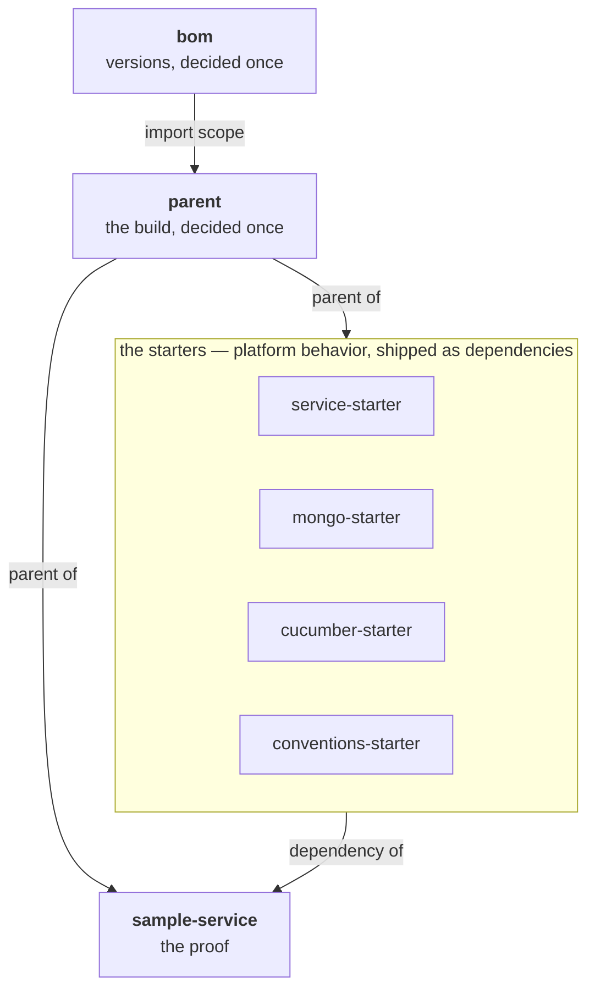
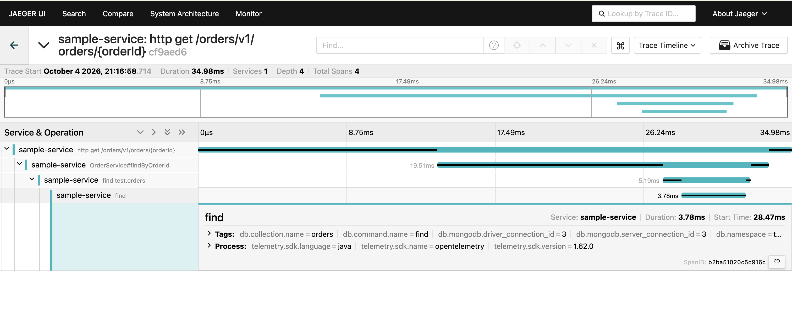

# 🛣️ spring-paved-road

[](https://github.com/vspiewak/spring-paved-road/actions/workflows/build.yml)  

**The paved road : parent, BOM & Spring Boot starters that align a whole fleet — distilled into one runnable monorepo.**

At work, ~80 Spring Boot services and the ~30 engineers who build them are moving onto these
patterns : one `<parent>` line in a service's pom, and it inherits version coherence, formatting
law, style rules and platform behavior. This repo is the pattern, extracted and runnable.

📝 The story so far : [migrating 1,273 repos in under an hour](https://vspiewak.com/migrating-1200-repos-from-bitbucket-to-github-in-under-an-hour) ·
[27,000+ PRs with gh-auto-updater](https://vspiewak.com/gh-auto-updater-mass-pull-requests-across-a-repo-fleet) — more on [vspiewak.com](https://vspiewak.com)

## 💡 The idea

A **paved road** is not a fence. Services get :

* **defaults they can override** — sane platform behavior, applied unless the service says otherwise
* **mandates they cannot** — security & governance values that win over any service configuration
* and everything else — versions, formatting, style — **by inheritance, not by copy-paste**

The whole pitch fits in one diff. A service pom, before and after :

```diff
 <parent>
-   <groupId>org.springframework.boot</groupId>
-   <artifactId>spring-boot-starter-parent</artifactId>
-   <version>4.1.0</version>
+   <groupId>com.vspiewak</groupId>
+   <artifactId>parent</artifactId>
+   <version>0.0.1-SNAPSHOT</version>
 </parent>
```

## 🧱 Modules

| Module | Role |
|---|---|
| 📌 [`bom/`](./bom) | Versions, decided once — services never write a `<version>` again |
| 🏗️ [`parent/`](./parent) | The build, decided once — plugins, formatting law, style rules, test lanes |
| 🍃 [`service‑starter/`](./service-starter) | Sane defaults & platform mandates, shipped as a dependency |
| 🥭 [`mongo‑starter/`](./mongo-starter) | The MongoDB defaults every service wants — self-seeding local dev, self-identifying connections, traced queries |
| 🥒 [`cucumber‑starter/`](./cucumber-starter) | The BDD vocabulary, written once — services write features, not glue |
| 👮 [`conventions‑starter/`](./conventions-starter) | The conventions, as tests that fail the build instead of review comments |
| 🧪 [`sample‑service/`](./sample-service) | The proof — one service consuming all of it, **the tests are the documentation** |



## ✨ What a service gets

One `<parent>` line and a few starter dependencies. Each module's README has the details — and the
tests that prove them.

**The build** — [`bom`](./bom) · [`parent`](./parent)

* 📌 **versions, decided once** — dependencies declared versionless ; a `<version>` fails the build at `validate`
* 🎨 **formatting law** — Spotless at `compile`, in both lanes ; `./format.sh` fixes it
* 🛤️ **two test lanes** — unit & slice in seconds without Docker, `*IT` against real containers, JaCoCo over both

**At runtime** — [`service-starter`](./service-starter) · [`mongo-starter`](./mongo-starter)

* 🪜 **the property ladder** — defaults a service can override, mandates it cannot
* 🚨 **one error contract** — `application/problem+json`, stamped with the service and the trace id
* 🔭 **traces, end to end** — HTTP → `@Observed` service → MongoDB as one trace, health probes left out
* ✈️ **an HTTP flight recorder** — `/actuator/httpexchanges` that actually records
* 🪧 **identity** — the platform banner, the service name on every log line
* 🌱 **a local dev loop that seeds itself** — JSON files into MongoDB, refused on any non-local host
* 🏷️ **connections, named** — every MongoDB connection carries `spring.application.name`

**In the tests** — [`cucumber-starter`](./cucumber-starter) · [`conventions-starter`](./conventions-starter)

* 🥒 **BDD without glue** — HTTP, JSON-path and MongoDB steps shipped ; services write features
* 👮 **conventions as tests** — layering, naming, app name, health probe : the build fails, not the review

And [`sample-service`](./sample-service) consuming all of it — **its tests are the documentation**.



## 🚀 Quick start

You need **Java 25** — `.sdkmanrc` pins Temurin 25.0.4 — and, for anything past the fast lane, a
running **Docker** daemon : [Testcontainers](https://testcontainers.com) starts a real MongoDB for
the `*IT` tests and for the dev loop. Maven itself comes with the repo, as the wrapper.

```bash
sdk env install      # Java 25 (Temurin) via sdkman, pinned in .sdkmanrc

./mvnw test          # fast lane : the whole reactor, no Docker, ~10s
./mvnw install       # full lane : + *IT (needs Docker), + coverage, and into ~/.m2
./format.sh          # apply the formatting law (spotless) on every governed module

# the local dev loop : sample-service + a MongoDB container + the auto-load seed
./mvnw -pl sample-service spring-boot:test-run
```

The dev loop is powered by
[`RunWithTestcontainers`](./sample-service/src/test/java/com/vspiewak/sample/RunWithTestcontainers.java) —
`spring-boot:test-run` boots the app from test sources, so the Testcontainers MongoDB and the
`local` profile come along for free. Mind the order above : `-pl` resolves the starters from
`~/.m2`, so `./mvnw install` has to have run once — and `-am` is no substitute, `test-run` being a
goal rather than a phase, which Maven would then run on `parent` too. It comes up on
`http://localhost:8080` :

| Endpoint | What you get |
|---|---|
| `GET /orders/v1/orders` | every order — the seed seen in `src/test/resources/mongo/import/orders/` |
| `GET /orders/v1/orders/{orderId}` | one order, or a `404` |
| `GET /actuator/health` | the deploy probe — `UP` |
| `GET /actuator/httpexchanges` | the flight recorder : the requests you just made |

The last two are exposed by `service-starter`'s defaults — the service's own `application.yaml`
never mentions them.

## ⚙️ Continuous integration

[`.github/workflows/build.yml`](./.github/workflows/build.yml) runs **the full lane**, on every push
to `main` and on every pull request : Temurin 25 with a Maven cache, then `./mvnw -ntp verify` —
formatting law, style rules, version mandate, both test lanes against real containers (GitHub's
runners ship Docker), coverage — one command, the same one you run locally. The badge at the top of
this README is that workflow.

## 📓 Boot 4 field notes

Building this on Spring Boot 4.1 / Java 25 surfaced real migration intel — moved packages, renamed
properties, a few that are *silently ignored* now. Collected in
[`docs/boot4-field-notes.md`](./docs/boot4-field-notes.md).

## ⚖️ At work vs here

| | At work | This repo |
|---|---|---|
| Repos | ~10, independent releases, CODEOWNERS | one reactor, for your cloning pleasure |
| Platform | Java 21 · Spring Boot 3.5 | Java 25 · Spring Boot 4.1 |
| Fleet | ~80 services, ~30 engineers | one sample service — yours to fork |

Same patterns, two platform generations apart — that's rather the point 😉
