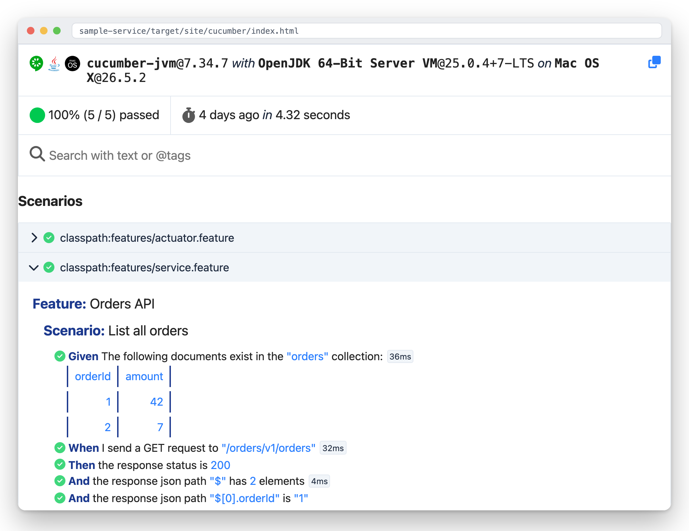

← [spring-paved-road](../README.md)

# 🥒 `cucumber-starter` — BDD, the shared vocabulary

Ships the step definitions every service needs anyway — HTTP requests, status & JSON-path
assertions, MongoDB seeding — so a service writes **features, not glue** :

```gherkin
Background:
  Given The following documents exist in the "orders" collection:
    | orderId | amount |
    | 1       | 42     |
    | 2       | 7      |

Scenario: List all orders
  When I send a GET request to "/orders/v1/orders"
  Then the response status is 200
  And the response json path "$" has 2 elements
```

...and gets, for free, a report that reads like the feature file it came from :



A service opts in with one test dependency and two tiny classes :
[`CucumberIT`](../sample-service/src/test/java/com/vspiewak/sample/cucumber/CucumberIT.java) (the JUnit 5 suite —
its glue lists the service package **plus** the starter's step packages) and
[`CucumberSpringConfiguration`](../sample-service/src/test/java/com/vspiewak/sample/cucumber/CucumberSpringConfiguration.java)
(`@CucumberContextConfiguration` + `@SpringBootTest(RANDOM_PORT)` + the Testcontainers config).
Steps are plain Spring beans — cucumber-spring instantiates them per scenario, `RestTestClient`
and `MongoTemplate` arrive by constructor injection, and seeding steps drop the collection first
so a scenario only ever sees what it seeds.

The `*IT` suffix puts the whole suite in the failsafe lane : `./mvnw test` stays Docker-free.

Every step the starter ships is exercised by the sample features. The work version carries the full
set : composed request bodies & headers, POST, JSON fixture matchers.
