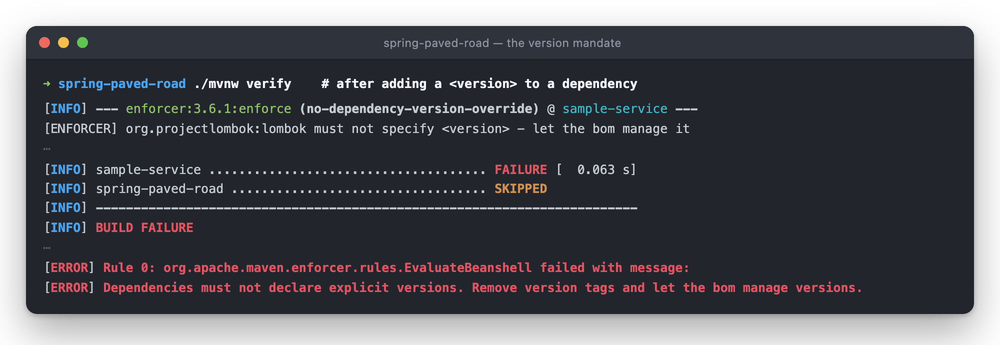
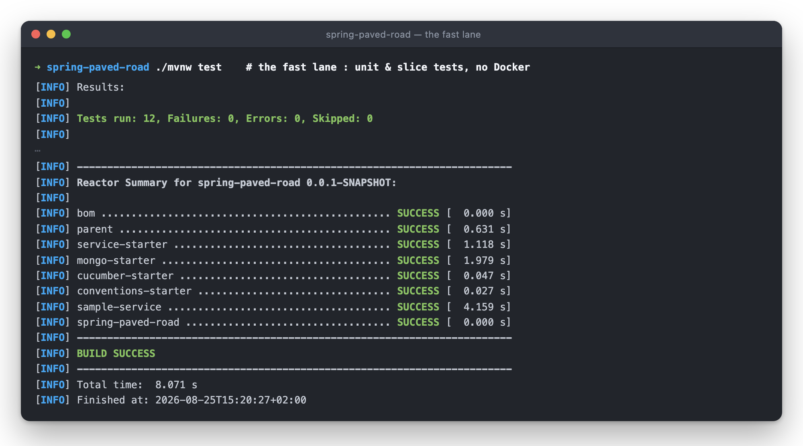
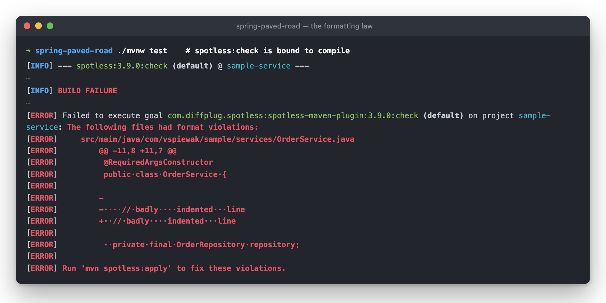
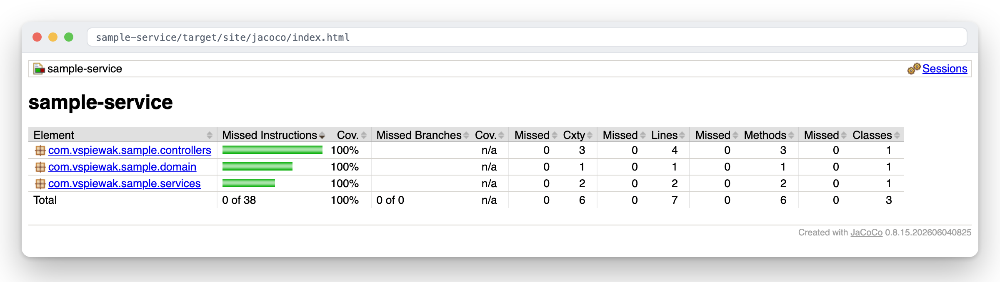

← [spring-paved-road](../README.md)

# 🏗️ `parent` — the build, decided once

Every service inherits the same build by pointing at this parent, which **imports** the bom
(no parent-chaining — the two concerns stay separately releasable) :

* every plugin version pinned once in `pluginManagement`
* the formatting law : [Spotless](https://github.com/diffplug/spotless) with google-java-format,
  sortPom, yaml & markdown — `spotless:check` runs at **`compile`**, so a formatting slip fails
  the build in *both* lanes, and `./format.sh` is the one command that fixes it
* a deliberately tiny [Checkstyle](https://checkstyle.org) ruleset — the interesting rules live in
  `conventions-starter`, as tests
* the **version mandate** : [maven-enforcer](https://maven.apache.org/enforcer/) fails the build on
  any dependency declaring a `<version>` — versions come from the bom, period
* and the test **lanes** : surefire / failsafe split on the `*IT` suffix,
  [JaCoCo](https://www.jacoco.org) covering both

The version mandate has one escape hatch : groupIds on the allow-list
(`enforcer.versionOverride.allowedGroupIds`, here `com.vspiewak.dto`) may pin their own version —
contract (DTO) artifacts evolve at the pace of their producer / consumer pair, not the fleet.
Try it : add a `<version>` to any dependency in `sample-service`, and the build stops you at
`validate` — before a single class is compiled :



It caught its first offender during its own introduction : `sample-service` itself, which pinned
the starters with `${project.version}` until the bom managed them.

```bash
./mvnw test          # fast lane : unit & slice tests — seconds, no Docker
./mvnw verify        # full lane : + *IT integration tests (Testcontainers) + coverage report
```



Break the formatting law and the build prints the offending diff and the fix :



`./format.sh` runs that `spotless:apply` across every governed module, skipping the bom and the root
aggregator : outside the parent chain, a naive `spotless:apply` resolves an **unpinned** spotless —
3.10.0 instead of the managed 3.9.0 — and fails on the bom anyway. A service under the parent needs
no script : `./mvnw spotless:apply`, as the failure message says.

Three hard-earned details, all of them failsafe / JaCoCo :

* the JaCoCo report is bound to **`post-integration-test`** — bind it any earlier and
  integration-test coverage silently vanishes from the report. Ask me how I know 🥲
* failsafe's `classesDirectory` defaults to *the built artifact JAR* — which, after
  `spring-boot:repackage`, is the fat jar with the classes buried under `BOOT-INF/classes`.
  Pointing it back at `${project.build.outputDirectory}` runs the `*IT` lane against plain class
  files, exactly like the fast lane.
* the Gherkin HTML report is switched on through failsafe's `argLine` — which **must** keep the
  `@{argLine}` placeholder, because that placeholder *is* the JaCoCo agent. Overwrite it and
  coverage quietly drops to zero.

Both reports land under `sample-service/target/site/` : coverage in `jacoco/index.html`, the
Gherkin run in `cucumber/index.html`.


