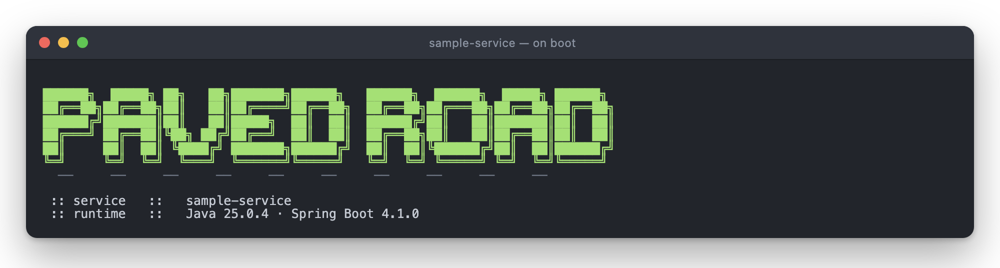

← [spring-paved-road](../README.md)

# 🍃 `service-starter` — platform behavior as a dependency

How every service behaves at runtime : sane defaults, platform mandates, auto-configured beans.
Both Boot extension points on display — an `EnvironmentPostProcessor` registered in
`spring.factories` (the property ladder) and `@AutoConfiguration`s registered in
`AutoConfiguration.imports` (the flight recorder, the tracing).

## 🪜 The property ladder

Configuration is layered around the application, lowest to highest precedence :

```text
platform-default.yaml                      # defaults (service CAN override)
  < application.yaml                       # the service's own configuration
    < platform-override.yaml               # mandates (service CANNOT override)
      < platform-override-<profile>.yaml   # per-profile mandates
```

Proven by [`PlatformPropertiesTest`](../sample-service/src/test/java/com/vspiewak/sample/platform/PlatformPropertiesTest.java) —
including the fun one : `sample-service` *tries* to set `management.endpoint.env.show-values: always`,
and the platform answers `never` 🔒 — and by the starter's own
[`ServiceStarterIT`](./src/test/java/com/vspiewak/pavedroad/env/ServiceStarterIT.java),
booting a bare context with zero service configuration.

## ✈️ The HTTP flight recorder

Boot ships the `/actuator/httpexchanges` endpoint but deliberately never auto-configures the
`HttpExchangeRepository` backing it — expose the endpoint without one and you get nothing.
`service-starter` fills exactly that gap : the endpoint is in the platform's exposure defaults, and
[`HttpExchangeConfig`](./src/main/java/com/vspiewak/pavedroad/actuator/HttpExchangeConfig.java)
provides the in-memory repository (last 100 exchanges) whenever the endpoint is available — every
service gets a free last-requests flight recorder. A service defining its own repository bean
replaces it (`@ConditionalOnMissingBean`).

Proven by [`HttpExchangeConfigTest`](./src/test/java/com/vspiewak/pavedroad/actuator/HttpExchangeConfigTest.java)
(provided when exposed, absent when not, backs off to a service-owned bean) and end-to-end by
[`HttpExchangesIT`](../sample-service/src/test/java/com/vspiewak/sample/platform/HttpExchangesIT.java) :
make a request, find it in `/actuator/httpexchanges`.

## 🚨 The error contract

`spring.mvc.problemdetails.enabled` lives in the **override** layer — a mandate, so the fleet's
error shape is not a per-service choice :

```text
before   application/json          {"timestamp","status","error","path"}
after    application/problem+json  {"type","title","status","detail","instance"}
```

On top of it, `service-starter` ships a
[`@ControllerAdvice`](./src/main/java/com/vspiewak/pavedroad/web/PlatformProblemDetailAdvice.java)
stamping each problem with its origin — the same `spring.application.name` that is on the banner and
on every log line :

```json
{"instance":"/orders/v1/orders/999","status":404,"title":"Not Found","service":"sample-service"}
```

`traceId` joins it when the MDC has one. `type` stays `about:blank` until a service declares one
under `problemDetail.type.<exception FQCN>`, which Spring resolves through the `MessageSource`.

Proven in business language, in
[`service.feature`](../sample-service/src/test/resources/features/service.feature) :

```gherkin
Scenario: Unknown orders are a 404, in the platform's error shape
  When I send a GET request to "/orders/v1/orders/999"
  Then the response status is 404
  And the response content type is "application/problem+json"
  And the response json path "$.title" is "Not Found"
  And the response json path "$.service" is "sample-service"
```

## 🔭 Traces, end to end

Boot already does the heavy lifting once tracing is on the classpath : a span per request, W3C
`traceparent` propagation, OTLP export as soon as `management.opentelemetry.tracing.export.otlp.endpoint`
is set. `service-starter` puts it on the classpath, then makes the calls Boot leaves to each service :

* **sample everything** — `management.tracing.sampling.probability: 1.0` (Boot's default is `0.1`), a default
* **`@Observed` on** — `management.observations.annotations.enabled: true`, with AspectJ shipped
* **trace ids on every log line** — `%correlationId` in the platform's console pattern, and in the
  error contract's `traceId`
* **health probes stay out of it** — [`TracingConfig`](./src/main/java/com/vspiewak/pavedroad/tracing/TracingConfig.java)
  drops actuator requests *and everything they cause* : drop only the request, and the database calls
  of its health indicators come back as orphan root traces, one per probe. Opt back in with
  `platform.tracing.actuator.enabled=true`

One request, one trace — `sample-service` with `platform.tracing.exporter.logging.enabled=true`,
which prints each span to the console the moment it ends, no collector needed :

```text
[f647ad56...-476a60f2...] LoggingSpanExporter : 'find' : f647ad56... CLIENT
[f647ad56...-476a60f2...] LoggingSpanExporter : 'find test.orders' : f647ad56... CLIENT
[f647ad56...-476a60f2...] LoggingSpanExporter : 'OrderService#findAll' : f647ad56... INTERNAL
[                       ] LoggingSpanExporter : 'http get /orders/v1/orders' : f647ad56... SERVER
```

Or a real waterfall — the transport is plain OTLP, so any collector will do :

```bash
docker run -d --name jaeger -p 16686:16686 -p 4318:4318 jaegertracing/all-in-one:1.62.0
./mvnw -pl sample-service spring-boot:test-run \
  -Dspring-boot.run.arguments="--management.opentelemetry.tracing.export.otlp.endpoint=http://localhost:4318/v1/traces"
```

`curl localhost:8080/orders/v1/orders/2`, then http://localhost:16686 :


Proven by [`TracingConfigTest`](./src/test/java/com/vspiewak/pavedroad/tracing/TracingConfigTest.java)
and end-to-end by [`TracingIT`](../sample-service/src/test/java/com/vspiewak/sample/platform/TracingIT.java),
which captures every span in memory : HTTP → service → MongoDB parented as one trace, the 404's
`traceId` is that trace's, and a health probe leaves nothing behind.

## 🪧 What a service inherits without asking

Two things ride on the default layer, and no service configures either. Identity — the platform
ships [`platform-banner.txt`](./src/main/resources/platform-banner.txt) and points
`spring.banner.location` at it :



And the shape of every line that service will ever log :

```yaml
logging:
  level:
    root: "INFO"
    org.mongodb.driver: "WARN"
    org.apache.catalina: "WARN"
  pattern:
    console: "%clr(%d{yyyy-MM-dd'T'HH:mm:ss.SSSXXX}){faint} %clr(%5p) %clr(%esb(){APPLICATION_NAME}){blue} ..."
```

```text
2026-08-26T00:07:04.894+02:00  INFO [sample-service]  c.v.sample.SampleServiceApplication : Starting SampleServiceApplication
```

Boot's PID and `---` are gone, the service name is in, and quieting those two dependencies takes a
bare `sample-service` boot from **15 log lines to 11**.

Both are **defaults**, so both bend : `spring.banner.location` for a service that wants its own
banner, `logging.level.org.mongodb.driver: DEBUG` for one that needs the driver's chatter — each
wins. `logging.config` is deliberately left unset, so a service that outgrows the defaults writes an
ordinary `logback-spring.xml` and is simply obeyed. All of it proven in
[`PlatformPropertiesTest`](../sample-service/src/test/java/com/vspiewak/sample/platform/PlatformPropertiesTest.java).
